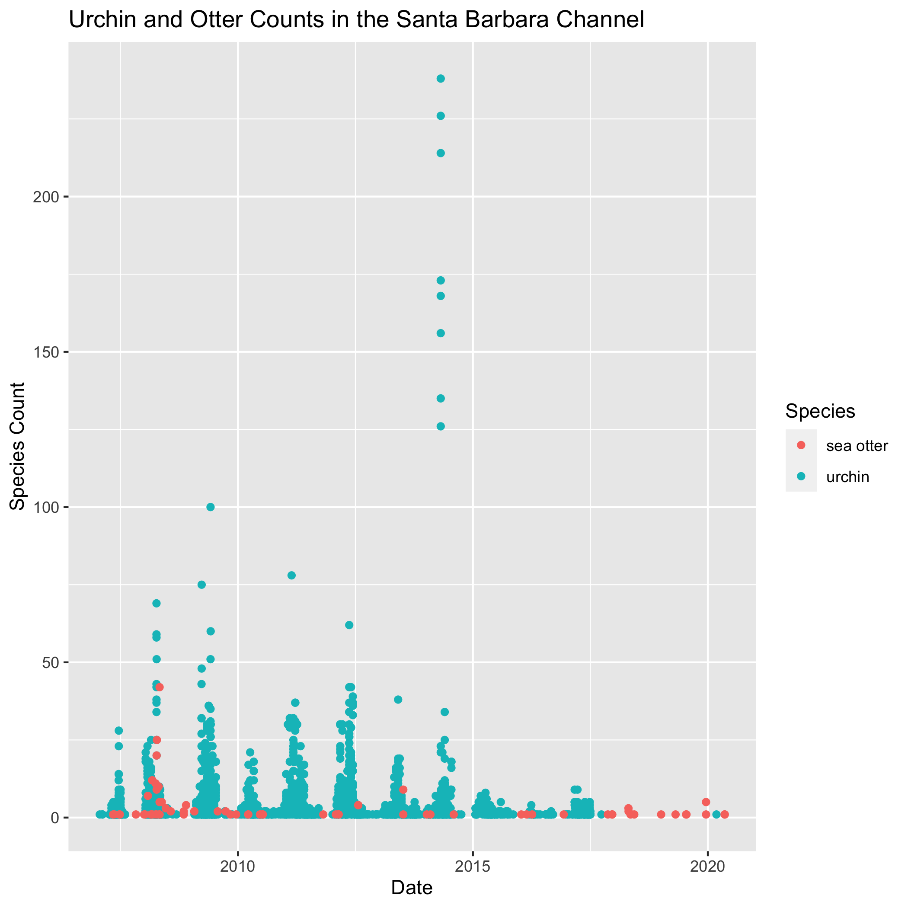

class: inverse, center, middle

# Question

How MPA's affect sea otter populations

(or how sea otter populations and urchin populations are correlated)

---

# Data Management Plan

Time: ~50% of the total project time for managing  data 
 - making sure  data is clean and accessible **Marie**
 - uploading relevant files to a repository **Halina**
 - making sure all individual data sets can be used together **Allie**

There are no legal constraints associated with acquiring, using and sharing project data. 					
					
Here is our [data log:](https://docs.google.com/spreadsheets/d/1E1X1hMrVCVCBCzP8_eBNz5QEc9xEMgIsqt7brjhbegc/edit?usp=sharing)	
.center[
```{r echo = FALSE, out.width= '95%'}

```
]
---

# API and Data Retrieval
Datasets are from DataOne and the Santa Barbara Coastal Long Term Monitoring Ecological Research (LTER) project

```{r out.width='100%', fig.height=6, eval=require('leaflet'), echo=FALSE}
library(leaflet)
leaflet() %>% addTiles() %>% setView(-120, 34, zoom = 8)
```
---

# API and Data Retrieval
#### Sea Otter Data  
Santa Barbara Coastal LTER, Daniel C Reed, Shannon Harrer, Clint J Nelson, and Robert J Miller. 2021. SBC LTER: Reef: Sightings of sea otters (Enhydra lutris) near Santa Barbara and Channel Islands, ongoing since 2007.

```{r, eval = FALSE}
data_lter_url <- "https://cn.dataone.org/cn/v2/resolve/https%3A%2F%2Fpasta.lternet.edu%2Fpackage%2Fdata%2Feml%2Fknb-lter-sbc%2F61%2F8%2F85e13b27599bf1ed68c7930674e1e7bd"

metajam::download_d1_data(data_lter_url, "data", "counts_sb")
```

#### Urchin Data
Santa Barbara Coastal LTER, Steven C Schroeter, John Douglas Dixon, Thomas Ebert, and John Richards. 2021. SBC LTER: Settlement of urchins and other invertebrates, ongoing since 1990. LTER Network Member

```{r, eval=FALSE}
data_urchins_url <- "https://cn.dataone.org/cn/v2/resolve/https%3A%2F%2Fpasta.lternet.edu%2Fpackage%2Fdata%2Feml%2Fknb-lter-sbc%2F52%2F10%2F6f1d97294f041ee3d39cda102e0223af"

metajam::download_d1_data(data_urchins_url, "data", "urchins")
```

---

# Merging Data
```{r comment='#', eval=FALSE}
otter_LTER_data <- otter_LTER_data %>%
  filter(YEAR <= 2020) %>%
  mutate(SITE = SBC_SITE) %>%
  mutate(SPECIES = "sea otter") %>%
  select(DATE, SITE, SPECIES, COUNT)
```

```{r comment='#', eval=FALSE}
urchins <- read_csv("https://cn.dataone.org/cn/v2/resolve/https%3A%2F%2Fpasta.lternet.edu%2Fpackage%2Fdata%2Feml%2Fknb-lter-sbc%2F52%2F10%2F6f1d97294f041ee3d39cda102e0223af", na = "-99999") %>%
  mutate(DATE = lubridate::mdy(DATE_RETRIEVED)) %>%
  filter(DATE >= "2007-01-01") %>%
  mutate(SPECIES = "urchin") %>%
  mutate(COUNT = TOTAL_URCHINS) %>%
  select(DATE, SITE, SPECIES, COUNT)
```
.center[
```{r echo = FALSE, out.width= '50%'}

```
]
---

# Results
.center[
```{r echo = FALSE, out.width= '70%'}

```
]
---
# Preserved Data
**Where?** The data will be preserved on [knb](https://dev.nceas.ucsb.edu/view/urn%3Auuid%3A89a211be-22dd-418b-a24b-9be29dc96f09)

.center[
```{r echo = FALSE, out.width= '60%'}

```
]
**Why?** knb is a more robust site that hosts a greater number of repositories when compared to other data repository sites

**How?** relevant data will be saved as both a **csv** and **txt file** 
- the csv (for now) is very accessible and can be quickly downloaded and used for analysis
- the txt file will most likely be able to withstand time for a longer period (can be opened by almost any program)
---
# Future Steps

- contact USGS for additional otter population data
- evaluate species counts before and after MPA was established
- evaluate species counts inside and outside of MPA

.center[
```{r echo = FALSE, out.width= '60%'}

```
]
